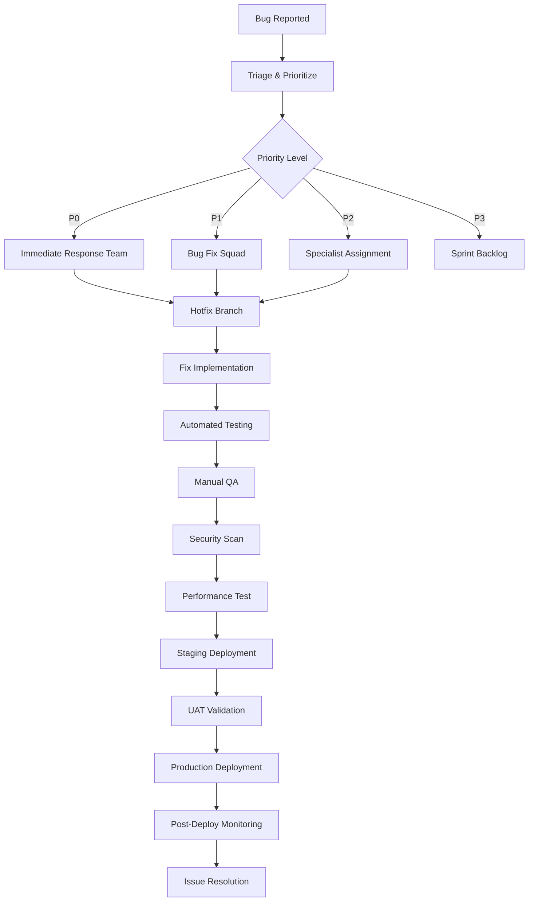

# SalesSync Production Deployment Team & Bug Fix Strategy

## 🚀 Deployment Team Structure

### Core Team Roles

#### 1. **Deployment Lead** 
- **Responsibilities**: Overall deployment coordination, risk assessment, go/no-go decisions
- **Skills**: DevOps expertise, system architecture knowledge, incident management
- **Tools**: CI/CD pipelines, monitoring dashboards, communication platforms

#### 2. **Bug Fix Squad**
- **Lead Developer**: Senior full-stack developer with deep SalesSync knowledge
- **Frontend Specialist**: React/TypeScript expert for UI/UX issues
- **Backend Specialist**: Node.js/API expert for server-side issues
- **Database Specialist**: Database optimization and data integrity expert

#### 3. **Quality Assurance Team**
- **QA Lead**: Test strategy and execution oversight
- **Automated Testing Engineer**: CI/CD test automation and maintenance
- **Manual Testing Specialist**: User acceptance testing and edge case validation
- **Performance Testing Engineer**: Load testing and performance optimization

#### 4. **DevOps & Infrastructure Team**
- **DevOps Engineer**: CI/CD pipeline management and infrastructure automation
- **Site Reliability Engineer**: Monitoring, alerting, and system reliability
- **Security Engineer**: Security scanning, vulnerability assessment, compliance

#### 5. **Support & Monitoring Team**
- **Production Support Lead**: Real-time monitoring and incident response
- **Customer Success Manager**: User impact assessment and communication
- **Technical Writer**: Documentation updates and deployment notes

## 🐛 Bug Fix Workflow

### Priority Classification

#### **P0 - Critical (Production Down)**
- **Response Time**: Immediate (< 15 minutes)
- **Resolution Time**: < 2 hours
- **Examples**: Complete system outage, data corruption, security breaches
- **Team**: Full deployment team activated

#### **P1 - High (Major Feature Broken)**
- **Response Time**: < 1 hour
- **Resolution Time**: < 24 hours
- **Examples**: Login failures, payment processing issues, data sync problems
- **Team**: Bug fix squad + QA lead

#### **P2 - Medium (Minor Feature Issues)**
- **Response Time**: < 4 hours
- **Resolution Time**: < 72 hours
- **Examples**: UI glitches, performance degradation, non-critical API errors
- **Team**: Relevant specialist + QA

#### **P3 - Low (Enhancement/Polish)**
- **Response Time**: Next sprint planning
- **Resolution Time**: Next release cycle
- **Examples**: UI improvements, feature requests, optimization opportunities
- **Team**: Development team during regular sprint

### Bug Fix Process



## 🔧 Production Deployment Process

### Pre-Deployment Checklist

#### **Code Quality Gates**
- [ ] All unit tests passing (>90% coverage)
- [ ] Integration tests passing
- [ ] End-to-end tests passing
- [ ] TypeScript compilation successful
- [ ] ESLint/Prettier checks passed
- [ ] Security vulnerability scan clean
- [ ] Performance benchmarks met

#### **Infrastructure Readiness**
- [ ] Database migrations tested
- [ ] Environment variables configured
- [ ] SSL certificates valid
- [ ] CDN cache invalidation planned
- [ ] Load balancer configuration updated
- [ ] Monitoring alerts configured

#### **Team Readiness**
- [ ] Deployment team assembled
- [ ] Rollback plan documented
- [ ] Communication channels active
- [ ] Customer support briefed
- [ ] Stakeholders notified

### Deployment Stages

#### **Stage 1: Pre-Production Validation**
```bash
# Automated deployment pipeline
npm run test:all
npm run build:production
npm run security:scan
npm run performance:test
```

#### **Stage 2: Staging Deployment**
```bash
# Deploy to staging environment
docker build -t salessync:staging .
docker-compose -f docker-compose.staging.yml up -d
npm run test:e2e:staging
```

#### **Stage 3: Blue-Green Production Deployment**
```bash
# Deploy to green environment
kubectl apply -f k8s/production/green-deployment.yml
kubectl rollout status deployment/salessync-green

# Health checks
curl -f https://green.salessync.com/health
npm run test:smoke:production

# Traffic switch
kubectl patch service salessync-service -p '{"spec":{"selector":{"version":"green"}}}'
```

#### **Stage 4: Post-Deployment Monitoring**
- Real-time error rate monitoring
- Performance metrics validation
- User experience monitoring
- Database performance checks
- API response time validation

## 📊 Monitoring & Alerting

### Key Metrics Dashboard

#### **System Health**
- Server response time (< 200ms target)
- Error rate (< 0.1% target)
- Database query performance
- Memory and CPU utilization
- Disk space and I/O metrics

#### **Business Metrics**
- User login success rate
- Transaction completion rate
- API endpoint availability
- Feature usage analytics
- Customer satisfaction scores

#### **Alert Thresholds**
```yaml
alerts:
  critical:
    error_rate: "> 1%"
    response_time: "> 2000ms"
    cpu_usage: "> 90%"
    memory_usage: "> 95%"
  
  warning:
    error_rate: "> 0.5%"
    response_time: "> 1000ms"
    cpu_usage: "> 80%"
    memory_usage: "> 85%"
```

## 🔄 Rollback Procedures

### Automated Rollback Triggers
- Error rate > 5% for 5 minutes
- Response time > 5000ms for 3 minutes
- Critical service unavailable
- Database connection failures

### Manual Rollback Process
```bash
# Immediate rollback to previous version
kubectl rollout undo deployment/salessync-production

# Database rollback (if needed)
npm run db:rollback:production

# Cache invalidation
npm run cache:clear:production

# Verify rollback success
npm run test:smoke:production
```

## 🛠️ Tools & Technologies

### Development & Testing
- **Version Control**: Git with GitFlow branching strategy
- **CI/CD**: GitHub Actions / Jenkins
- **Testing**: Vitest, Playwright, Jest
- **Code Quality**: ESLint, Prettier, SonarQube
- **Security**: Snyk, OWASP ZAP

### Infrastructure & Deployment
- **Containerization**: Docker, Docker Compose
- **Orchestration**: Kubernetes / Docker Swarm
- **Cloud Platform**: AWS / Azure / GCP
- **CDN**: CloudFlare / AWS CloudFront
- **Database**: PostgreSQL with read replicas

### Monitoring & Observability
- **APM**: New Relic / Datadog / AppDynamics
- **Logging**: ELK Stack (Elasticsearch, Logstash, Kibana)
- **Metrics**: Prometheus + Grafana
- **Uptime Monitoring**: Pingdom / UptimeRobot
- **Error Tracking**: Sentry / Bugsnag

### Communication & Collaboration
- **Chat**: Slack / Microsoft Teams
- **Incident Management**: PagerDuty / Opsgenie
- **Documentation**: Confluence / Notion
- **Project Management**: Jira / Linear

## 📋 Standard Operating Procedures

### Daily Operations
1. **Morning Health Check** (9:00 AM)
   - Review overnight alerts and logs
   - Check system performance metrics
   - Validate backup completion
   - Update team on system status

2. **Deployment Windows**
   - **Regular Deployments**: Tuesday/Thursday 2:00 PM - 4:00 PM EST
   - **Hotfixes**: Any time with proper approval
   - **Major Releases**: Saturday 10:00 PM - 2:00 AM EST

3. **Weekly Reviews**
   - Performance trend analysis
   - Security vulnerability assessment
   - Capacity planning review
   - Team retrospective and improvements

### Incident Response
1. **Detection** (Automated alerts or user reports)
2. **Assessment** (Impact and severity evaluation)
3. **Response** (Team activation and initial response)
4. **Resolution** (Fix implementation and validation)
5. **Recovery** (System restoration and monitoring)
6. **Post-Mortem** (Root cause analysis and prevention)

## 🎯 Success Metrics

### Deployment Success KPIs
- **Deployment Frequency**: Target 2-3 deployments per week
- **Lead Time**: < 2 hours from commit to production
- **Mean Time to Recovery (MTTR)**: < 30 minutes
- **Change Failure Rate**: < 5%
- **Deployment Success Rate**: > 98%

### Quality Metrics
- **Bug Escape Rate**: < 2% of releases
- **Customer-Reported Issues**: < 1 per release
- **Performance Regression**: 0 tolerance
- **Security Vulnerabilities**: 0 critical, < 5 medium

### Team Performance
- **Response Time to P0 Issues**: < 15 minutes
- **Resolution Time for P1 Issues**: < 24 hours
- **Team Satisfaction Score**: > 4.5/5
- **Knowledge Sharing Sessions**: 2 per month

## 📞 Emergency Contacts

### Escalation Matrix
```
Level 1: On-Call Engineer (24/7)
├── Phone: +1-XXX-XXX-XXXX
├── Slack: @oncall-engineer
└── Email: oncall@salessync.com

Level 2: Team Lead (Business Hours + On-Call)
├── Phone: +1-XXX-XXX-XXXX
├── Slack: @team-lead
└── Email: teamlead@salessync.com

Level 3: Engineering Manager (Escalation Only)
├── Phone: +1-XXX-XXX-XXXX
├── Slack: @eng-manager
└── Email: manager@salessync.com

Level 4: CTO (Critical Issues Only)
├── Phone: +1-XXX-XXX-XXXX
├── Slack: @cto
└── Email: cto@salessync.com
```

### External Vendors
- **Cloud Provider Support**: AWS/Azure/GCP Premium Support
- **CDN Support**: CloudFlare Enterprise Support
- **Database Support**: PostgreSQL Professional Services
- **Security Consultant**: Third-party security firm

---

## 🔐 Security & Compliance

### Security Deployment Checklist
- [ ] Dependency vulnerability scan
- [ ] Container image security scan
- [ ] Infrastructure security review
- [ ] Data encryption validation
- [ ] Access control verification
- [ ] Audit log configuration
- [ ] Compliance requirements met

### Compliance Requirements
- **GDPR**: Data protection and privacy compliance
- **SOC 2**: Security and availability controls
- **PCI DSS**: Payment card data security (if applicable)
- **HIPAA**: Healthcare data protection (if applicable)

This deployment team structure and bug fix strategy ensures robust, reliable, and secure production deployments for SalesSync while maintaining high availability and user satisfaction.