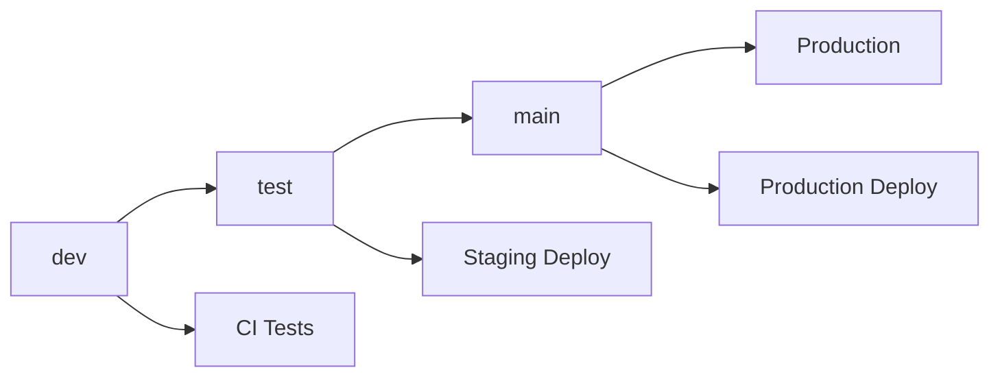

# 🔄 SALESSYNC GIT WORKFLOW

## 📋 BRANCH STRATEGY

### **Branch Structure**
```
main (production)
├── test (staging/testing)
└── dev (development)
    ├── feature/feature-name
    ├── bugfix/bug-description
    └── hotfix/critical-fix
```

### **Branch Purposes**
- **`main`**: Production-ready code, deployed to https://ss.gonxt.tech
- **`test`**: Staging environment for final testing before production
- **`dev`**: Development integration branch
- **`feature/*`**: New feature development
- **`bugfix/*`**: Bug fixes
- **`hotfix/*`**: Critical production fixes

---

## 🚀 DEPLOYMENT PIPELINE

### **Development → Test → Main → Production**



### **Automated Triggers**
1. **Push to `dev`**: Run tests, build validation
2. **Push to `test`**: Deploy to staging, run integration tests
3. **Push to `main`**: Deploy to production, run production validation

---

## 📝 WORKFLOW RULES

### **1. Development Work**
```bash
# Start new feature
git checkout dev
git pull origin dev
git checkout -b feature/new-feature-name

# Work on feature
git add .
git commit -m "feat: implement new feature"

# Push feature branch
git push origin feature/new-feature-name

# Create PR to dev branch
gh pr create --base dev --title "feat: new feature" --body "Description"
```

### **2. Testing Phase**
```bash
# After dev branch is ready for testing
git checkout test
git pull origin test
git merge dev
git push origin test

# This triggers staging deployment
```

### **3. Production Release**
```bash
# After testing is complete
git checkout main
git pull origin main
git merge test
git push origin main

# This triggers production deployment
```

### **4. Hotfix Process**
```bash
# Critical production fix
git checkout main
git pull origin main
git checkout -b hotfix/critical-issue

# Fix the issue
git add .
git commit -m "hotfix: fix critical production issue"

# Push and create PR to main
git push origin hotfix/critical-issue
gh pr create --base main --title "hotfix: critical issue" --body "Description"

# After merge, also merge to test and dev
git checkout test && git merge main && git push origin test
git checkout dev && git merge main && git push origin dev
```

---

## ✅ COMMIT CONVENTIONS

### **Commit Message Format**
```
<type>(<scope>): <description>

[optional body]

[optional footer]
```

### **Types**
- **feat**: New feature
- **fix**: Bug fix
- **docs**: Documentation changes
- **style**: Code style changes (formatting, etc.)
- **refactor**: Code refactoring
- **test**: Adding or updating tests
- **chore**: Maintenance tasks
- **perf**: Performance improvements
- **ci**: CI/CD changes

### **Examples**
```bash
git commit -m "feat(van-sales): add loading confirmation functionality"
git commit -m "fix(auth): resolve JWT token refresh issue"
git commit -m "docs: update API documentation"
git commit -m "ci: update deployment pipeline"
```

---

## 🔒 BRANCH PROTECTION RULES

### **Main Branch Protection**
- ✅ Require pull request reviews (2 reviewers)
- ✅ Require status checks to pass
- ✅ Require branches to be up to date
- ✅ Restrict pushes to main branch
- ✅ Require signed commits

### **Test Branch Protection**
- ✅ Require pull request reviews (1 reviewer)
- ✅ Require status checks to pass
- ✅ Allow force pushes for testing

### **Dev Branch Protection**
- ✅ Require status checks to pass
- ✅ Allow direct pushes for development

---

## 🚦 CI/CD PIPELINE STAGES

### **Development Stage (dev branch)**
```yaml
- Install dependencies
- Run linting
- Run type checking
- Run unit tests
- Build frontend
- Build backend
- Security scan
```

### **Staging Stage (test branch)**
```yaml
- All development checks
- Deploy to staging environment
- Run integration tests
- Run E2E tests
- Performance testing
- Security testing
```

### **Production Stage (main branch)**
```yaml
- All staging checks
- Deploy to production
- Run production validation
- Monitor deployment
- Notify team
```

---

## 📊 QUALITY GATES

### **Code Quality Requirements**
- ✅ All tests must pass
- ✅ Code coverage > 80%
- ✅ No linting errors
- ✅ No TypeScript errors
- ✅ Security scan passes
- ✅ Performance benchmarks met

### **Review Requirements**
- ✅ Code review by senior developer
- ✅ Architecture review for major changes
- ✅ Security review for auth/payment changes
- ✅ Performance review for database changes

---

## 🔧 DEVELOPMENT COMMANDS

### **Setup Development Environment**
```bash
# Clone repository
git clone https://github.com/Reshigan/SalesSync.git
cd SalesSync

# Checkout development branch
git checkout dev

# Install dependencies
cd frontend && npm install
cd ../backend && npm install

# Start development servers
npm run dev:all
```

### **Testing Commands**
```bash
# Run all tests
npm run test

# Run specific test suites
npm run test:unit
npm run test:integration
npm run test:e2e

# Run with coverage
npm run test:coverage
```

### **Build Commands**
```bash
# Development build
npm run build:dev

# Production build
npm run build:prod

# Analyze bundle
npm run analyze
```

---

## 🚨 EMERGENCY PROCEDURES

### **Production Hotfix**
1. Create hotfix branch from main
2. Fix the critical issue
3. Test locally
4. Create PR to main (expedited review)
5. Deploy immediately after merge
6. Monitor production
7. Backport to test and dev branches

### **Rollback Procedure**
```bash
# Rollback to previous version
git checkout main
git revert HEAD
git push origin main

# Or rollback to specific commit
git reset --hard <previous-commit-hash>
git push --force-with-lease origin main
```

---

## 📈 MONITORING & METRICS

### **Branch Health Metrics**
- Build success rate
- Test coverage percentage
- Deployment frequency
- Lead time for changes
- Mean time to recovery

### **Code Quality Metrics**
- Code review turnaround time
- Bug detection rate
- Security vulnerability count
- Performance regression detection

---

## 👥 TEAM RESPONSIBILITIES

### **Developers**
- Follow branch naming conventions
- Write meaningful commit messages
- Ensure tests pass before pushing
- Request code reviews
- Keep branches up to date

### **Tech Leads**
- Review architectural changes
- Approve major feature PRs
- Monitor code quality metrics
- Manage release planning

### **DevOps**
- Maintain CI/CD pipelines
- Monitor deployment health
- Manage infrastructure
- Handle emergency deployments

---

## 📚 RESOURCES

### **Documentation**
- [API Documentation](./docs/api.md)
- [Frontend Architecture](./docs/frontend.md)
- [Backend Architecture](./docs/backend.md)
- [Deployment Guide](./docs/deployment.md)

### **Tools**
- **Git**: Version control
- **GitHub Actions**: CI/CD
- **ESLint**: Code linting
- **TypeScript**: Type checking
- **Jest**: Unit testing
- **Playwright**: E2E testing

---

## 🎯 SUCCESS CRITERIA

### **Development Success**
- ✅ All tests pass
- ✅ Code review approved
- ✅ No merge conflicts
- ✅ Documentation updated

### **Staging Success**
- ✅ Integration tests pass
- ✅ Performance benchmarks met
- ✅ Security scans clean
- ✅ User acceptance testing complete

### **Production Success**
- ✅ Zero-downtime deployment
- ✅ All health checks pass
- ✅ Monitoring alerts normal
- ✅ User experience unaffected

---

**Remember: Quality over speed. Every commit should move us closer to a more stable, secure, and performant system.**